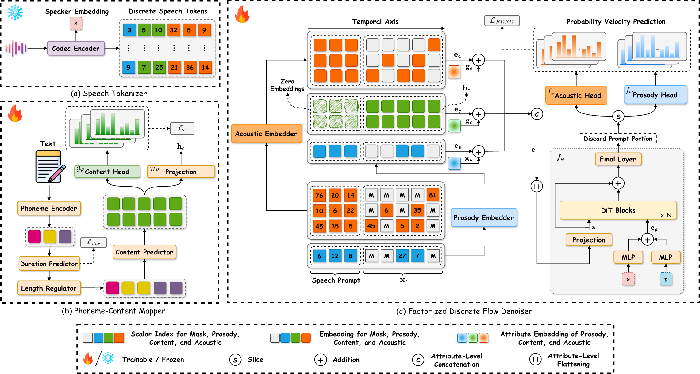

<div align="center">

<h2>DiFlow-TTS: Compact and Low-Latency Zero-Shot Text-to-Speech with Discrete Flow Matching</h2>

<a href="https://nngocson2002.github.io/"><strong><u>Ngoc-Son Nguyen</u></strong><sup>1</sup></a> &nbsp;&nbsp;&nbsp;
<a href="https://thanhtvt.github.io/"><strong><u>Thanh V. T. Tran</u></strong><sup>1</sup></a> &nbsp;&nbsp;&nbsp;
<a href="https://scholar.google.com/citations?user=sGFCHdcAAAAJ&hl=en"><strong><u>Hieu-Nghia Huynh-Nguyen</u></strong><sup>1</sup></a> &nbsp;&nbsp;&nbsp;
<a href="https://scholar.google.com/citations?user=JiKBo6UAAAAJ&hl=en"><strong><u>Truong-Son Hy</u></strong><sup>2</sup></a> &nbsp;&nbsp;&nbsp;
<a href="https://scholar.google.com/citations?user=rJe1704AAAAJ&hl=en"><strong><u>Van Nguyen</u></strong><sup>1†</sup></a>

<sup>1</sup> FPT Software AI Center, Vietnam &nbsp;&nbsp; <sup>2</sup> University of Alabama at Birmingham, USA

<sup>†</sup> Corresponding author

<a href='https://arxiv.org/abs/2509.09631'></a>
</div>

   

## 🎬 Framework

  

## 📦 Code Release
The official code will be released soon. Stay tuned!

## 📝 Citation
If you find this work useful, please cite:
```bibtex
@article{diflowtts,
      title={DiFlow-TTS: Compact and Low-Latency Zero-Shot Text-to-Speech with Discrete Flow Matching}, 
      author={Ngoc-Son Nguyen and Thanh V. T. Tran and Hieu-Nghia Huynh-Nguyen and Truong-Son Hy and Van Nguyen},
      journal = {Interspeech 2026},
      year={2026},
      url={https://arxiv.org/abs/2509.09631}, 
}
```
